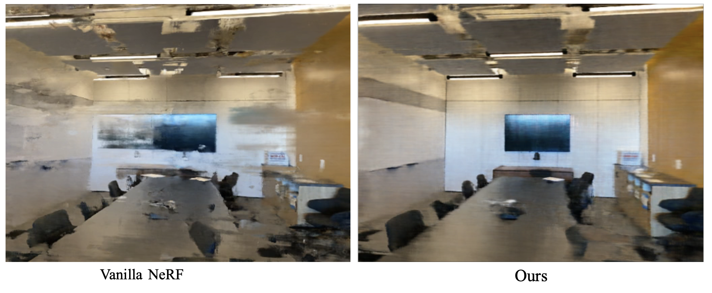

# NeRF-Sparse-View

This project is based on PyTorch implementation of [NeRF](http://www.matthewtancik.com/nerf).

This project proposed a two-stage Neural Radiance Field (NeRF) training approach to generate 3D objects from sparse 2D training images, addressing the complexity of this task. In the first stage, we develop a NeRF that creates a 3D object based solely on its spatial coordinates (x, y, z), significantly narrowing the range of potential solutions to fit the training images. The second stage involves refining the NeRF model to incorporate the effect of the viewing angle on the object’s appearance, thereby restoring its ability to capture light variation. This method separates the 3D synthesis process into spatial and angular considerations, improving the efficiency and accuracy of 3D reconstruction. Our method has demonstrated encouraging results when applied to basic NeRF architecture in with sparse training scenes.



## Installation

```
git clone https://github.com/kena910108/NeRF-Sparse-Views.git
cd nerf-pytorch
pip install -r requirements.txt
```
  
</details>

### Quick Start

create ./data directory
Download data from [here](https://drive.google.com/drive/folders/128yBriW1IG_3NJ5Rp7APSTZsJqdJdfc1) to ./data

To train a NeRF, go to ./myconfigs and edit your configurations .txt file, e.g.,:
```
python3.10 run_nerf.py --config myconfigs/room_two_stage_50000.txt
```

## Proposed method details

Please see:
https://docs.google.com/presentation/d/1Bz1q78KXS6FeMMM1EeH5NojYrQzAbPzu/edit?usp=sharing&ouid=118039195692722156361&rtpof=true&sd=true